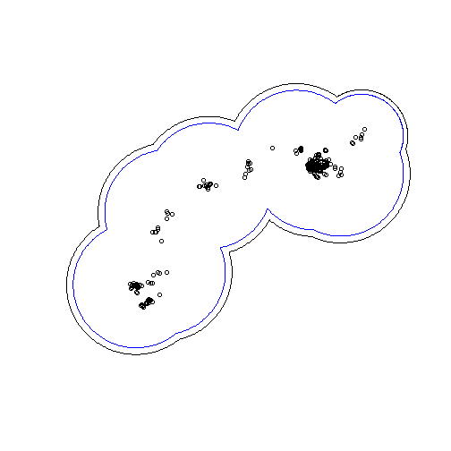

---
output:
  md_document:
    variant: markdown_github
---

<!-- README.md is generated from README.Rmd. Please edit that file -->


## wildlifeTG: Time Geographic Home Range Analysis

Methods for performing time geographic home range analysis as described in the papers:

Long, J.A. (2018) Modelling movement probabilities within heterogeneous spatial fields. Journal
of Spatial Information Science. Accepted: 2017-12-18.

Long, J.A., Webb, S.L., Nelson, T.A., Gee, K. (2015) Mapping areas of spatial-temporal
overlap from wildlife telemetry data. Movement Ecology. 3:38.

Long, J.A., Nelson, T.A. (2015) Home range and habitat analysis using dynamic time
geography. Journal of Wildlife Management. 79(3): 481-490.

Nelson, T.A., Long, J.A., Laberee, K., Stewart, B.P. (2015) A time geographic approach for
delineating areas of sustained wildlife use. Annals of GIS. 21(1): 81-90.

Long, J.A., Nelson, T.A. (2012) Time geography and wildlife home range delineation.
Journal of Wildlife Management. 76(2): 407-413.

### Installation


```r
devtools::install_github("jedalong/wildlifeTG")
```
  
### Quick demo

Calculate a quick PPA home range and compare with points:


```r
library(wildlifeTG, message = FALSE, warning = FALSE)
#> Error in library(wildlifeTG, message = FALSE, warning = FALSE): unused arguments (message = FALSE, warning = FALSE)

data(m3)                      #Caribou tracking data

#PPA home range
hr1 <- dynppa(m3)
hr2 <- dynppa(m3,method='vanderWatt')
plot(hr1)
plot(hr2,border='blue',add=T)


library(adehabitatLT)
points(ld(m3)$x,ld(m3)$y)
```



```r
#plot(spt,add=T,col='red')
```


--- End ---
